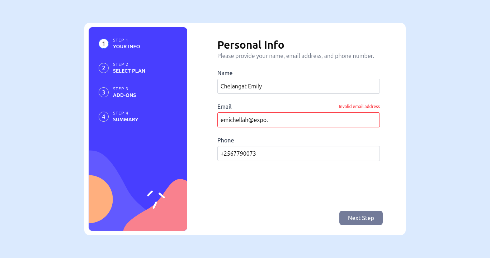

# Frontend Mentor - Multi-step form solution

This is a solution to the [Multi-step form challenge on Frontend Mentor](https://www.frontendmentor.io/challenges/multistep-form-YVAnSdqQBJ). Frontend Mentor challenges help you improve your coding skills by building realistic projects.

## Table of contents

- [Overview](#overview)
  - [The challenge](#the-challenge)
  - [Screenshot](#screenshot)
  - [Links](#links)
- [My process](#my-process)
  - [Built with](#built-with)
  - [What I learned](#what-i-learned)
  - [Continued development](#continued-development)
  - [Useful resources](#useful-resources)
- [Author](#author)
- [Acknowledgments](#acknowledgments)

**Note: Delete this note and update the table of contents based on what sections you keep.**

## Overview

### The challenge

Users should be able to:

- Complete each step of the sequence
- Go back to a previous step to update their selections
- See a summary of their selections on the final step and confirm their order
- View the optimal layout for the interface depending on their device's screen size
- See hover and focus states for all interactive elements on the page
- Receive form validation messages if:
  - A field has been missed
  - The email address is not formatted correctly
  - A step is submitted, but no selection has been made

### Screenshot



Add a screenshot of your solution. The easiest way to do this is to use Firefox to view your project, right-click the page and select "Take a Screenshot". You can choose either a full-height screenshot or a cropped one based on how long the page is. If it's very long, it might be best to crop it.

Alternatively, you can use a tool like [FireShot](https://getfireshot.com/) to take the screenshot. FireShot has a free option, so you don't need to purchase it.

Then crop/optimize/edit your image however you like, add it to your project, and update the file path in the image above.

**Note: Delete this note and the paragraphs above when you add your screenshot. If you prefer not to add a screenshot, feel free to remove this entire section.**

### Links

- Solution URL: [Add solution URL here](https://github.com/AskTiba/bit-by-bit)
- Live Site URL: [Add live site URL here](https://bit-by-bit-sigma.vercel.app/challenges/multi-step-form)

## My process

### Built with

- Semantic HTML5 markup
- Tailwind CSS custom properties
- Flexbox
- CSS Grid
- Mobile-first workflow
- [Next.js](https://nextjs.org/) - React framework
- React Hook Forms
- Zustand State Management

### What I learned

I have learned a few things above responsive design that i didn't know before. I also struggled a bit implementing Zustand state management for the very first time. I very much enjoyed the idea of persistance.

```typescript
import { create } from "zustand";
import { devtools, persist } from "zustand/middleware";
import { MyFormData } from "../types/formData";

type FormStep = "personal" | "plan" | "addons" | "finishing";

type FormStore = {
  formData: MyFormData;
  updateFormData: (data: Partial<MyFormData>) => void;
  resetFormData: () => void;
  step: FormStep;
  setStep: (step: FormStep) => void;
};

export const useFormStore = create<FormStore>()(
  devtools(
    persist(
      (set) => ({
        formData: {
          name: "",
          email: "",
          phone: "",
          plan: "",
          planPrice: 0,
          addons: [],
          addonPrices: [],
          isYearly: false,
        },

        step: "personal",

        updateFormData: (data) =>
          set(
            (state) => ({
              formData: {
                ...state.formData,
                ...data,
              },
            }),
            false,
            "form/updateFormData"
          ),

        resetFormData: () =>
          set(
            () => ({
              formData: {
                name: "",
                email: "",
                phone: "",
                plan: "",
                planPrice: 0,
                addons: [],
                addonPrices: [],
                isYearly: false,
              },
              step: "personal",
            }),
            false,
            "form/resetFormData"
          ),

        setStep: (step) => set(() => ({ step }), false, "form/setStep"),
      }),
      {
        name: "FormStore", // 👈 shows up in localStorage and Redux Devtools
      }
    )
  )
);
```

### Continued development

Well I experienced lots of challenges working on state management with Zustand, trying to use it with typescript and all. I intend to researching more on how to use and implement both Zustand and typescript.

Also the whole concept of responsive design is still abit challenging but hopefully with alot of research and practice in my future projects i will leaarn how to smoothly navigate the challenges i encontered here, then i will come back update this project.

### Useful resources

- [React Hook Forms](https://www.react-hook-form.com/) - This helped me handle complex forms with validation in a cleaner, more performant way. I really liked how it minimizes re-renders by using uncontrolled components under the hood. The useForm hook pattern felt very ergonomic, and the integration with TypeScript was seamless. I’ll definitely use it as my default form solution going forward.
- [Zustand](https://zustand.docs.pmnd.rs/getting-started/introduction) - Zustand helped me manage global state in a minimal and intuitive way without the boilerplate of Redux. I appreciated the simplicity of using hooks directly to access and update state. It’s especially powerful for local-first apps and when shared state doesn’t need a complex setup. I’ll be using this pattern for both React and React Native projects going forward.
- [Tailwind documentaion](https://v2.tailwindcss.com/docs) - This is an amazing reference that helped me finally understand utility-first CSS. It made styling much more maintainable and scalable across my projects. I loved how Tailwind encourages design consistency by tying directly into a token-based design system. I'd recommend it to any frontend developer looking to move faster while keeping things clean and responsive.
- [TypeScript Documentation](https://www.typescriptlang.org/docs/) - This helped me deeply understand type safety and how to use interfaces, types, generics, and utility types like Partial or Pick. It really leveled up my confidence in writing robust, maintainable React code. I’d recommend it to anyone transitioning from JavaScript to TypeScript or aiming to write more predictable applications.

## Author

- Frontend Mentor - [@AskTiba](https://www.frontendmentor.io/profile/AskTiba)
- Twitter - [@AskTiba](https://x.com/AskTiba)

## Acknowledgments

- I would like to thank Chingu who indirectly inspireed and motivated me to build this project. They requesteed me to bild a solo project as a proof and i did but later go motivated to work on more and so more will be worked on inthe future.

- Am aslo gratetful to Frontend Mentor of availing the challenge with enough resources for anyone to attempt working on a solution. Despite the fact that i was working on the free plan i was able to enjoy meself as i was figuring out some solution to the challenges i faced.
