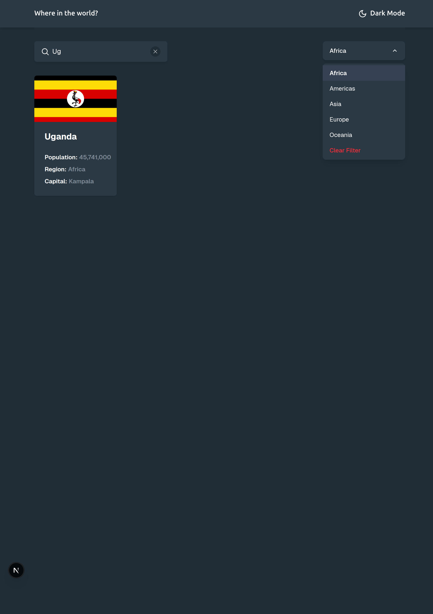
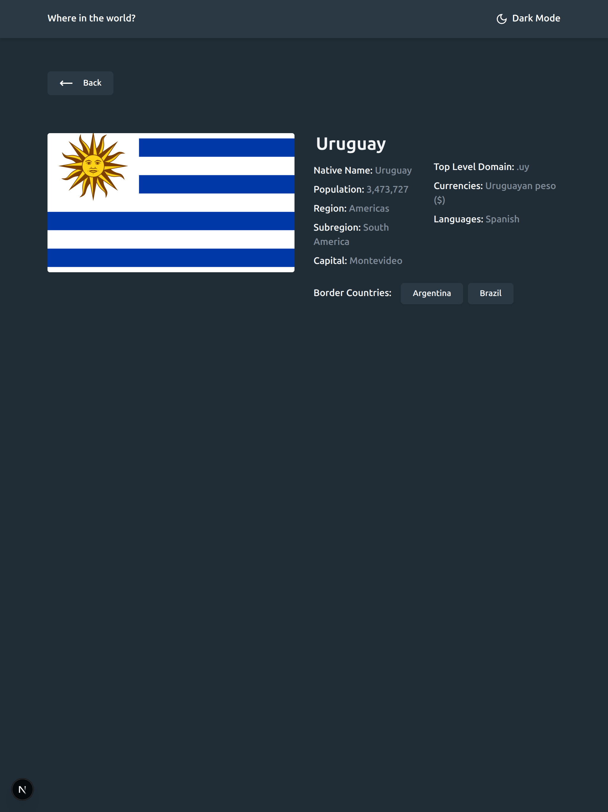
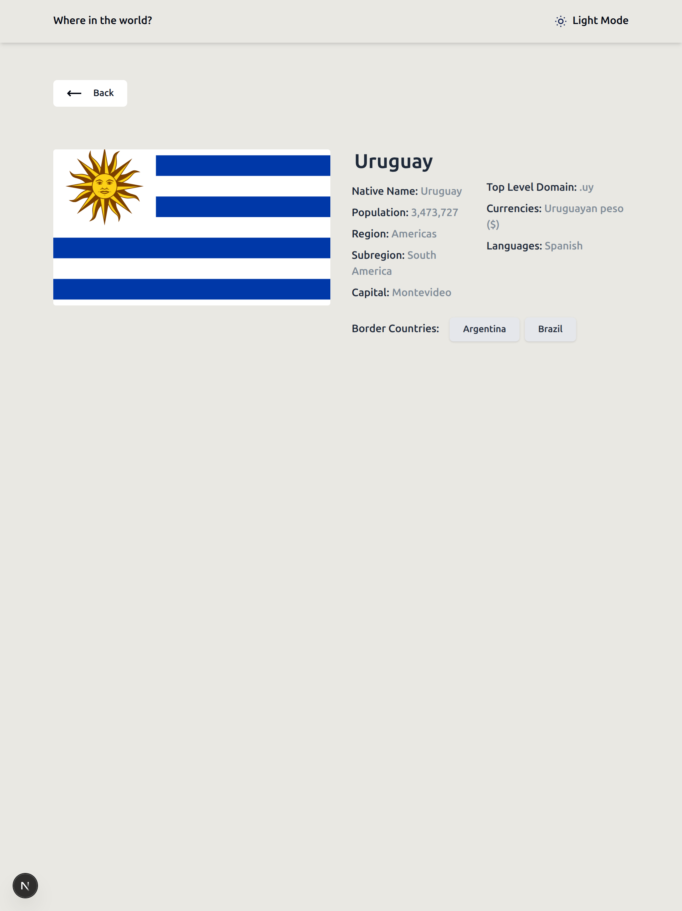

# Frontend Mentor - REST Countries API with color theme switcher solution

This is a solution to the [REST Countries API with color theme switcher challenge on Frontend Mentor](https://www.frontendmentor.io/challenges/rest-countries-api-with-color-theme-switcher-5cacc469fec04111f7b848ca). Frontend Mentor challenges help you improve your coding skills by building realistic projects.

## Table of contents

- [Overview](#overview)
  - [The challenge](#the-challenge)
  - [Screenshot](#screenshot)
  - [Links](#links)
- [My process](#my-process)
  - [Built with](#built-with)
  - [What I learned](#what-i-learned)
  - [Continued development](#continued-development)
  - [Useful resources](#useful-resources)
- [Author](#author)
- [Acknowledgments](#acknowledgments)

## Overview

### The challenge

Users should be able to:

- See all countries from the API on the homepage
- Search for a country using an `input` field
- Filter countries by region
- Click on a country to see more detailed information on a separate page
- Click through to the border countries on the detail page
- Toggle the color scheme between light and dark mode _(optional)_

### Screenshots

|           Home Page (Light Mode)            |           Home Page (Dark Mode)            |        Detail Page (Dark Mode)        |
| :-----------------------------------------: | :----------------------------------------: | :-----------------------------------: |
|  |  |  |

### Links

- [Solution URL](https://github.com/AskTiba/bit-by-bit/tree/main/src/app/challenges/rest-countries-api)
- [Live Site URL](https://bit-by-bit-sigma.vercel.app/challenges/rest-countries-api)

## My process

### Built with

- Semantic HTML5 markup
- CSS custom properties
- Flexbox
- CSS Grid
- Mobile-first workflow
- [React](https://reactjs.org/) - JS library
- [Next.js](https://nextjs.org/) - React framework
- [Tailwind CSS](https://tailwindcss.com/) - For styling
- [Zustand](https://zustand-bear.github.io/zustand/) - State management (for theme switching)

### What I learned

This project provided a great opportunity to deepen my understanding of:

- **Next.js Dynamic Routes:** Implementing `[details]/page.tsx` for country-specific detail pages was a good exercise in Next.js's dynamic routing capabilities.
- **Client-side Data Fetching and Filtering:** The `CountryExplorer` component effectively handles search and region filtering on the client-side using `useState` and `useMemo` for optimized performance.
- **State Management with Zustand:** The theme switching functionality demonstrated a practical use case for Zustand, ensuring a smooth and reactive user experience for toggling between light and dark modes.
- **Responsive Design with Tailwind CSS:** Leveraging Tailwind's utility-first classes allowed for efficient and flexible styling across different screen sizes, adhering to a mobile-first approach.
- **Image Optimization with Next/Image:** Utilizing the `next/image` component for country flags ensured optimized image loading and performance.

```jsx
// Example of dynamic routing in [details]/page.tsx
const CountryDetailsPage = () => {
  const params = useParams();
  const countryName = params.details as string;
  // ...
};
```

```typescript
// Example of Zustand store for theme management
import { create } from "zustand";
import { persist } from "zustand/middleware";

interface ThemeState {
  isDarkMode: boolean;
  toggleTheme: () => void;
  hasHydrated: boolean;
  setHasHydrated: (hydrated: boolean) => void;
}

export const useThemeStore = create<ThemeState>()(
  persist(
    (set) => ({
      isDarkMode: false,
      toggleTheme: () => set((state) => ({ isDarkMode: !state.isDarkMode })),
      hasHydrated: false,
      setHasHydrated: (hydrated) => set({ hasHydrated: hydrated }),
    }),
    {
      name: "theme-storage",
      onRehydrateStorage: () => (state) => {
        state?.setHasHydrated(true);
      },
    }
  )
);
```

### Continued development

I plan to continue exploring:

- **Server-side Rendering (SSR) and Static Site Generation (SSG) with Next.js:** While this project used client-side data fetching, I'd like to implement SSR or SSG for the country list to improve initial load performance and SEO.
- **Integration with a real API:** Currently, the project uses mock data. I aim to integrate with a live REST Countries API to fetch real-time data.
- **Accessibility improvements:** Further enhance accessibility features, especially for keyboard navigation and screen reader compatibility.

### Useful resources

- [Next.js Documentation](https://nextjs.org/docs) - An invaluable resource for understanding Next.js features like routing and image optimization.
- [Tailwind CSS Documentation](https://tailwindcss.com/docs) - Excellent documentation for mastering utility-first CSS.
- [Zustand GitHub Repository](https://github.com/pmndrs/zustand) - The official documentation and examples were very helpful for state management.

## Author

- Website - [Add your name here](https://www.your-site.com)
- Frontend Mentor - [@AskTiba](https://www.frontendmentor.io/profile/AskTiba)
- Twitter - [@AskTiba](https://www.twitter.com/AskTiba)

## Acknowledgments

This challenge was provided by Frontend Mentor.
